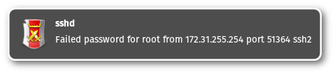

journal-notify
==============

**Notify about journal log entries**

This runs in background and produces notifications whenever systemd journal
logs an entry. Notifications look like this:

Before flooding the desktop this will throttle notifications:

Requirements
------------

To compile and run `journal-notify` you need:

* [libnotify](https://developer.gnome.org/notification-spec/)
* [libsystemd](https://www.github.com/systemd/systemd)
* [markdown](https://daringfireball.net/projects/markdown/) (HTML documentation)
* `gnome-icon-theme` (or whatever includes the icons you want to use)

To use `journal-notify` you probably want `systemd-journald`.

Some systems may require additional development packages for the libraries.
Look for `libnotify-devel`, `libsystemd-devel` or similar.

Build and install
-----------------

Building and installing is very easy. Just run:

> make

followed by:

> make install

This will place an executable at `/usr/bin/journal-notify`,
documentation can be found in `/usr/share/doc/journal-notify/`.

Usage
-----

To use `journal-notify` you need access to the journal log files. Make sure
you get the expexted log entries by running `journalctl`. Possibly you have
to add yourself to group `systemd-journal` or similar.

Just running `journal-notify` without parameter will show *all* log entries.
Be warned: This can flood your disktop with notifications.

`journal-notify` accepts some options:

* *-a*: combine matches with a logical AND
* *-e*: use extended regular expressions
* *-h*: show help
* *-i ICON*: icon to use
* *-m MATCH*: This can be specified more than once. The option accepts matches
 to systemd journal fields. (see `man 7 systemd.journal-fields`)
* *-n*: no case sensitive regular expressions
* *-o*: combine matches with a logical OR
* *-r REGEX*: This add a regular expression match for the message field.
* *-t SECONDS*: seconds to show the notification, 0 is forever
* *-T THROTTLE*: start throttling with Nth notification
* *-v*: verbose output, can be specified multiple times
* *-V*: print version information
* *-x EXECUTABLE*: execute EXECUTABLE
* *-X EXECUTABLE*: execute EXECUTABLE, do not show notification

The screenshot shown above resulted from this command:

> journal-notify -m SYSLOG_IDENTIFIER=sshd -e -r "^(error:|Accepted)"
-i security-high

The command specified by `-x` is called with three options. Make sure
your executable understands these options:

* *-i*: syslog identifier
* *-p*: priority
* *-m*: message

Additionally example desktop files are installed to
`/usr/share/journal-notify/desktop/`. You should copy them to
`~/.config/autostart/` to enable autostart or create your own desktop files
there.

Example execute scripts are installed to `/usr/share/journal-notify/execute/`.
Review and update them before execution, for example you should replace the
mail address in `mail.sh` with your own one.

Example systemd units are installed to `/usr/share/journal-notify/systemd/`.
To use them copy to `/etc/systemd/system/` and `systemctl enable`. Again, make
sure to change unit file and script for your needs!

### Upstream

URL:
[GitHub.com](https://github.com/eworm-de/journal-notify#journal-notify)

Mirror:
[eworm.de](https://git.eworm.de/cgit.cgi/journal-notify/)
[GitLab.com](https://gitlab.com/eworm-de/journal-notify#journal-notify)
